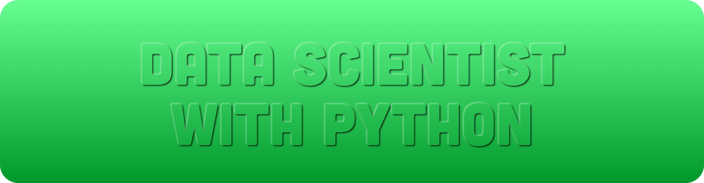

---

1. [Introduction to Python](./docs/1.Introduction-to-Python/)
2. [Intermediate Python](./docs/2.Intermediate-Python/)
3. ###### PROJECT 
   **Investigating Netflix Movies and Guest Stars in The Office**
     > Apply the foundational Python skills you learned in Introduction to Python and Intermediate Python by manipulating and visualizing movie and TV data.

4. [Data Manipulation with pandas](./docs/4.Data-Manipulation-with-Pandas/)
5. [Joining Data with Pandas](./docs/5.Joining-Data-with-Pandas/)
6. [Introduction to Statistics in Python](./docs/6.Introduction-to-Statistics-in-Python/)
7. ###### PROJECT   
    **The GitHub History of the Scala Language**
    > Find the true Scala experts by exploring its development history in Git and GitHub.
8. [Introduction to Data Visualization with Matplotlib](./docs/8.Introduction-to-Data-Visualization-with-Matplotlib/)
9. [Introduction to Data Visualization with Seaborn](./docs/9.Introduction-to-Data-Visualization-with-Seaborn/)
10. [Introduction to NumPy](./docs/10.Introduction-to-NumPy/)
11. [Python Data Science Toolbox (Part 1)](./docs/11.Python-Data-Science-Toolbox-Part1/)
12. ###### PROJECT 
    **The Android App Market on Google Play**
    > Load, clean, and visualize scraped Google Play Store data to gain insights into the Android app market.
13. [Python Data Science Toolbox (Part 1)](./docs/13.Python-Data-Science-Toolbox-Part-1/)
14. [Intermediate Data Visualization with Seaborn](./docs/14.Intermediate-Data-Visualization-with-Seaborn/)
15. [Data Communication Concepts](./docs/15.Data-Communication-Concepts/)
16. ###### PROJECT 
    **A Visual History of Nobel Prize Winners**
    > Explore a dataset from Kaggle containing a century's worth of Nobel Laureates. Who won? Who got snubbed?
17. ###### SKILL ASSESSMENT 
    **Data Manipulation with Python**
18. [Introduction to Importing Data in Python](./docs/18.Introduction-to-Importing-Data-in-Python/)
19. [Intermediate Importing Data in Python](./docs/19.Intermediate-Importing-Data-in-Python/)
20. [Cleaning Data in Python](./docs/20.Cleaning-Data-in-Python/)
21. [Working with Dates and Times in Python](./docs/21.Working-with-Dates-and-Times-in-Python/)
22. ###### SKILL ASSESSMENT 
    **Importing & Cleaning Data With Python**
23. [Writing Functions in Python](./docs/23.Writing-Functions-in-Python/)
24. ###### SKILL ASSESSMENT 
    **Python Programming**
25. [Exploratory Data Analysis in Python](./docs/25.Exploratory-Data-Analysis-in-Python/)
26. [Analyzing Police Activity with pandas](./docs/26.Analyzing-Police-Activity-with-pandas/)
27. [Introduction to Regression with statsmodels in Python](./docs/27.Introduction-to-Regression-with-statsmodels-in-Python/)
28. [Sampling in Python](./docs/28.Sampling-in-Python/)
29. [Hypothesis Testing in Python](./docs/29.Hypothesis-Testing-in-Python/)
30. ###### PROJECT 
    **Dr. Semmelweis and the Discovery of Handwashing**
    > Reanalyse the data behind one of the most important discoveries of modern medicine: handwashing.
31. [Supervised Learning with Scikit-Learn](./docs/31.Supervised-Learning-with-Scikit-Learn/)
32. ###### PROJECT 
    **Predicting Credit Card Approvals**
    > Build a machine learning model to predict if a credit card application will get approved.
33. [Unsupervised Learning in Python](./docs/33.Unsupervised-Learning-in-Python/)
34. [Machine Learning with Tree-Based Models in Python](./docs/34.Machine-Learning-with-Tree-Based-Models-in-Python/)
